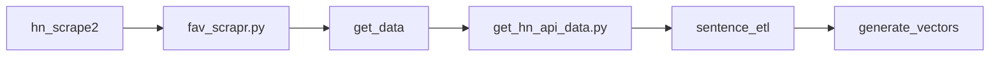

# hn_fav_cluster
---
HN Favorite Data Pipeline
----

```mermaid
    flowchart LR;
        hn_scrape2 --> fav_scrapr.py --> get_data --> get_hn_api_data.py --> sentence_etl --> generate_vectors;

```
